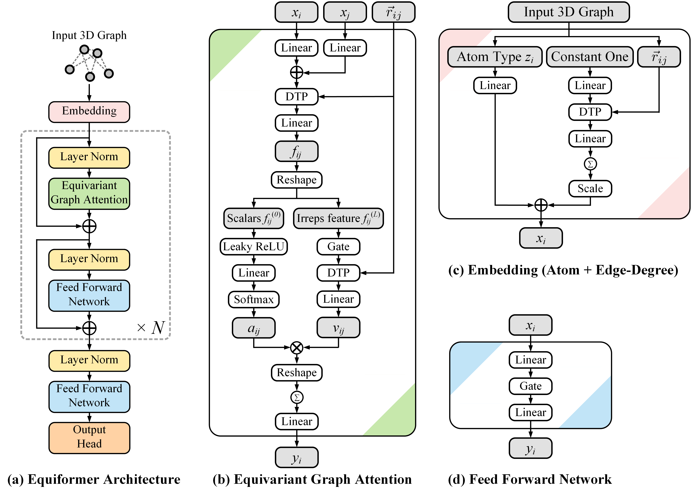

# Equiformer: Equivariant Graph Attention Transformer for 3D Atomistic Graphs


**[Paper](https://arxiv.org/abs/2206.11990)** | **[OpenReview](https://openreview.net/forum?id=KwmPfARgOTD)**


This repository contains the official PyTorch implementation of the work "Equiformer: Equivariant Graph Attention Transformer for 3D Atomistic Graphs" (ICLR 2023 Spotlight).


<p align="center">
	
</p>


## Content ##
0. [Environment Setup](#environment-setup)
0. [Training](#training)
0. [File Structure](#file-structure)
0. [Acknowledgement](#acknowledgement)
0. [Citation](#citation)


## Environment Setup ##


### Environment 

See [here](docs/env_setup.md) for setting up the environment.


### QM9

The dataset of QM9 will be automatically downloaded when running training.


### MD17

The dataset of MD17 will be automatically downloaded when running training.


### OC20

The dataset for different tasks can be downloaded by following instructions in their [GitHub repository](https://github.com/Open-Catalyst-Project/ocp/blob/main/DATASET.md#download-and-preprocess-the-dataset).
After downloading, place the datasets under `datasets/oc20/` by using `ln -s`.
Take `is2re` as an example:

```bash
    cd datasets
    mkdir oc20
    cd oc20
    ln -s ~/ocp/data/is2re is2re
```


## Training ##


### QM9

1. We provide training scripts under [`scripts/train/qm9/equiformer`](scripts/train/qm9/equiformer).
For example, we can train Equiformer for the task of `alpha` by running:

    ```bash
        sh scripts/train/qm9/equiformer/target@1.sh
    ```

2. The QM9 dataset will be downloaded automatically as we run training for the first time.

3. The target number for different regression tasks can be found [here](https://pytorch-geometric.readthedocs.io/en/latest/generated/torch_geometric.datasets.QM9.html#torch_geometric.datasets.QM9).

4. We also provide the code for training Equiformer with linear messages and dot product attention.
To train Equiformer with linear messages, replace `--model-name 'graph_attention_transformer_nonlinear_l2'` with `--model-name 'graph_attention_transformer_l2'` in training scripts.

5. The training scripts for Equiformer with linear messages and dot product attention can be found in [`scripts/train/qm9/dp_equiformer`](scripts/train/qm9/dp_equiformer).

6. Training logs of Equiformer can be found [here](https://www.dropbox.com/sh/9yuah73ss9na8tw/AACWZSoqddgeRiL4kFuVEn7Ra?dl=0).


### MD17

1. We provide training scripts under [`scripts/train/md17/equiformer`](scripts/train/md17/equiformer).
For example, we can train Equiformer for the molecule of `aspirin` by running:

    ```bash
        sh scripts/train/md17/equiformer/se_l2/target@aspirin.sh    # L_max = 2
        sh scripts/train/md17/equiformer/se_l3/target@aspirin.sh    # L_max = 3
    ```

2. Training logs of Equiformer with $L_{max} = 2$ and $L_{max} = 3$ can be found [here](https://www.dropbox.com/sh/yriizguj1m7t891/AACh395HiqCC0G7Lv4YURlyra?dl=0) ($L_{max} = 2$) and [here](https://www.dropbox.com/sh/1xrpzd1op0kwcpf/AABFYmgq0ZIprDE82RAY7oPSa?dl=0) ($L_{max} = 3$). Note that the units of energy and force are kcal mol $^{-1}$ and kcal mol $^{-1}$ Å $^{-1}$ and that we report energy and force in units of meV and meV Å $^{-1}$ in the paper. 


### OC20

1. We train Equiformer on **IS2RE data only** by running:

    ```bash
        sh scripts/train/oc20/is2re/graph_attention_transformer/l1_256_nonlinear_split@all_g@2.sh
    ```

    a. This requires 2 GPUs and results in energy MAE of around 0.5088 eV for the ID sub-split of the validation set.

    b. Pretrained weights and training logs can be found [here](https://www.dropbox.com/sh/gfmzs0yxz8g54pi/AABcnBweIUajQTJsjvSdjxf3a?dl=0).


2. We train Equiformer on **IS2RE data with IS2RS auxiliary task and Noisy Nodes data augmentation** by running:

    ```bash
        sh scripts/train/oc20/is2re/graph_attention_transformer/l1_256_blocks@18_nonlinear_aux_split@all_g@4.sh
    ```

    a. This requires 4 GPUs and results in energy MAE of around 0.4156 eV for the ID sub-split of the validation set.

    b. Pretrained weights and training logs can be found [here](https://www.dropbox.com/sh/kijz22aulnyptql/AAD4s54XOkY9BSZ-ZzRoviWNa?dl=0).


## File Structure ##

We have different files and models for QM9, MD17 and OC20.

### General 

1. [`nets`](nets) includes code of different network architectures for QM9, MD17 and OC20.
2. [`scripts`](scripts) includes scripts for training models for QM9, MD17 and OC20.
 

### QM9

1. [`main_qm9.py`](main_qm9.py) is the training code for QM9 dataset.


### MD17

1. [`main_md17.py`](main_md17.py) is the code for training and evaluation on MD17 dataset.


### OC20

Some differences are made to support:
- Removing weight decay for certain parameters specified by `no_weight_decay`. One example is [here](nets/graph_attention_transformer_oc20.py#L247).
- Cosine learning rate.

1. [`main_oc20.py`](main_oc20.py) is the code for training and evaluating.
2. [`oc20/trainer`](oc20/trainer) contains the code for energy trainers.
3. [`oc20/configs`](oc20/configs) contains the config files for IS2RE.


## Acknowledgement ##

Our implementation is based on [PyTorch](https://pytorch.org/), [PyG](https://pytorch-geometric.readthedocs.io/en/latest/index.html), [e3nn](https://github.com/e3nn/e3nn), [timm](https://github.com/huggingface/pytorch-image-models), [ocp](https://github.com/Open-Catalyst-Project/ocp), [SEGNN](https://github.com/RobDHess/Steerable-E3-GNN) and [TorchMD-NET](https://github.com/torchmd/torchmd-net).


## Citation ##

If you use our code or method in your work, please consider citing the following:

```bibtex
@inproceedings{
    liao2023equiformer,
    title={Equiformer: Equivariant Graph Attention Transformer for 3D Atomistic Graphs},
    author={Yi-Lun Liao and Tess Smidt},
    booktitle={International Conference on Learning Representations},
    year={2023},
    url={https://openreview.net/forum?id=KwmPfARgOTD}
}
```

Please direct any questions to Yi-Lun Liao (ylliao@mit.edu).